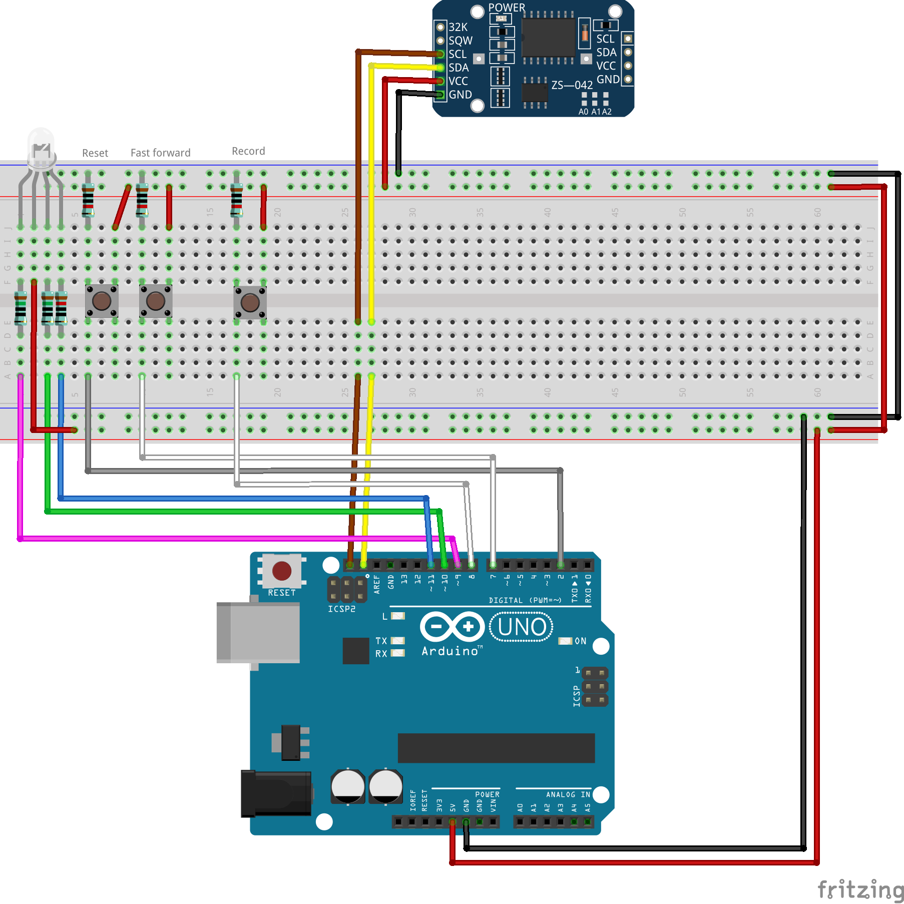

Medicine reminder
=================

A program for Arduino that can be used to remind you, for example, to take your
medicine. The idea is that you have a RGB led that acts as an indicator: If the
led is green, things are all right, but the more red the led gets the longer you
have been without taking your medicine. The only thing you have to remember to
do, when taking medicine, is to press the reset button, which sets the led green
again.

One reason I made this program is because if you have to take medicine
regularly, it quickly becomes a habit. And when it becomes a habit, you might
oftentimes forget, whether you just have taken the medicine or not. But now, if
you add just one button press to your habit, Arduino will tell you whether you
just took the medicine or not.

## About the program

The color shift time (time it takes for the indicator to turn from green to red)
is 12 hours by default.

There are three buttons that this program currently supports:
* A reset button, which resets the indicator led to green.
* A fast forward button, which can be used to gradually turn the led more red by
  holding it, if you, for example, accidentally pressed the reset button.
* A time record button, which toggles the recording feature:
  * When pressed while not recording
    * the record led turns on and
    * recording starts.
  * When pressed while recording
    * the record led turns off,
    * the recording ends and
    * the time between the start and end of the recording is set to be the new
      color shift time.

## Installation

1. Open this project with [PlatformIO](https://platformio.org/platformio-ide).
1. If you are using Arduino Uno or Arduino Nano (Atmega328P w/ old bootloader),
   just comment out the board you aren't using in the `env_default =` setting of
   _platformio.ini_ file.
    * Otherwise add your board to the file with its own `[env:board_id_here]`
      section and the board id to the `env_default =` setting.
    * Remember to change the pin numbers in the _src/MedicineReminder.ino_ file,
      if needed.
1. Build and upload the project to your Arduino. PlatformIO will install the
   dependencies for you.

There are two example images (made using
[Fritzing](http://fritzing.org/download/)) of the required components and
connections in the _schematics_ folder. The model of the RTC board is
_DS3231 AT24C32_.

